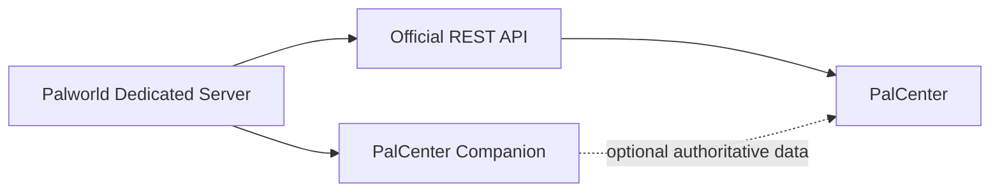

# PalCenter Companion

PalCenter Companion is an optional server-side extension for Palworld dedicated servers. It augments the official Palworld REST API with authoritative game events and state that PalCenter cannot reliably infer from polling alone.

PalCenter works fully without the Companion. When a compatible Companion is available, PalCenter can discover its capabilities and prefer authoritative data while retaining the official REST API as the fallback.

> [!IMPORTANT]
> This repository currently contains architecture, contracts, and contributor tooling only. It does not contain game hooks, an HTTP server, WebSocket code, or gameplay integrations.

## Why it exists

The official REST API remains the primary interface for standard server administration. Some future intelligence features require information from inside the game server, such as authoritative event boundaries or coordinate-space identity. The Companion will expose that information through separate, local interfaces without changing or replacing the official API.

The Companion is independent:

- PalCenter does not require it.
- The Companion does not require PalCenter.
- The official REST API is never modified or replaced.
- No cloud service, analytics collection, or external telemetry is required.
- Data remains local to the server administrator.

## Foundation scope

Application version `0.1.0` establishes:

- the separately versioned Companion API at `/palcenter/v1/`;
- contracts for `GET /health`, `GET /version`, and `GET /capabilities`;
- capability negotiation;
- future event, coordinate-space, and live-stream designs;
- project governance and lightweight validation.

See the [API overview](docs/API.md) and [OpenAPI contract](api/openapi.yaml). These interfaces are specifications, not implemented endpoints.

## Long-term vision

PalCenter Companion is an authoritative event source, not a collection of helper endpoints. Future releases may expose world events, coordinate spaces, guilds, bases, structures, breeding, bosses, captures, performance information, moderation actions, and other administration capabilities. Each capability will be explicitly negotiated, versioned, local-first, and designed to degrade gracefully when unavailable.

PalCenter's intelligence engine should prefer authoritative Companion events over heuristic inference. When the Companion is absent or a capability is unavailable, PalCenter should continue using the official REST API and its existing inference behavior.

## Documentation

- [Architecture](docs/ARCHITECTURE.md)
- [API design](docs/API.md)
- [Capability negotiation](docs/CAPABILITIES.md)
- [Event model](docs/EVENT-MODEL.md)
- [Real-time stream](docs/REAL-TIME.md)
- [Coordinate spaces](docs/COORDINATE-SPACES.md)
- [Guiding principles](docs/PRINCIPLES.md)
- [Roadmap](ROADMAP.md)
- [Contributing](CONTRIBUTING.md)
- [Security](SECURITY.md)

## Project status

The project is in its foundation milestone. No production installation artifact is available yet. Follow the [roadmap](ROADMAP.md) for planned milestones; roadmap items are directional and not promises of delivery dates.

## License

Repository-authored material is available under the [MIT License](LICENSE). Palworld and related names and assets are the property of their respective owners. PalCenter Companion is an unofficial community project and is not affiliated with or endorsed by Pocketpair, Inc.
