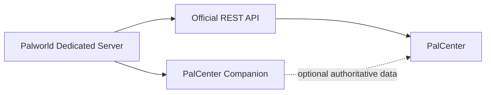

# PalCenter Companion

PalCenter Companion is an optional server-side extension for Palworld dedicated servers. It augments the official Palworld REST API with authoritative game events and state that PalCenter cannot reliably infer from polling alone.

PalCenter works fully without the Companion. When a compatible Companion is available, PalCenter can discover its capabilities and prefer authoritative data while retaining the official REST API as the fallback.

> [!IMPORTANT]
> Version 0.1.0 is the first implementation milestone. It provides an embedded discovery API and UE4SS lifecycle adapter only. It contains no gameplay hooks, player information, telemetry, game events, or WebSocket service.

## Why it exists

The official REST API remains the primary interface for standard server administration. Some future intelligence features require information from inside the game server, such as authoritative event boundaries or coordinate-space identity. The Companion will expose that information through separate, local interfaces without changing or replacing the official API.



The Companion is independent:

- PalCenter does not require it.
- The Companion does not require PalCenter.
- The official REST API is never modified or replaced.
- No cloud service, analytics collection, or external telemetry is required.
- Data remains local to the server administrator.

## Current scope

Application version `0.1.0` provides:

- the separately versioned Companion API at `/palcenter/v1/`;
- embedded `GET /health`, `GET /version`, and `GET /capabilities` endpoints;
- a UE4SS C++ extension lifecycle that starts and stops with PalServer;
- local INI configuration and UE4SS-integrated startup logging;
- capability negotiation with all gameplay capabilities disabled;
- future event, coordinate-space, and live-stream designs;
- a platform-neutral core with automated endpoint and lifecycle tests.

See the [installation guide](docs/INSTALLATION.md), [framework evaluation](docs/research/FRAMEWORK-EVALUATION.md), [API overview](docs/API.md), and [OpenAPI contract](api/openapi.yaml).

## Compatibility and build status

The production release candidate is pinned to Palworld Dedicated Server Steam build `24466863` (game version `v1.0.2.101103`) and Okaetsu RE-UE4SS commit `c838a8acaade1a0f860bdf249f039e58f4e10088`. The real DLL has passed initial load, endpoint, configuration, restart, private-network, PalDefender, and Offline Raid Protection UAT. PR #2 remains a draft because the pinned UE4SS process-exit path does not call C++ mod uninstall handlers and an actual Palworld client connection has not yet been tested.

Public CI produces `PalCenterCompanion-contract-test.dll`. It validates PalCenter-owned lifecycle, endpoint, and shutdown behavior but is not a distributable UE4SS DLL. Authorized contributors can build and package the real `main.dll` using the exact Visual Studio, Windows SDK, Rust, and UE4SS pins in [Production Toolchain](docs/TOOLCHAIN.md), then complete [Live PalServer UAT](docs/LIVE-PALSERVER-UAT.md).

## Installation summary

PalCenter Companion is built as a UE4SS C++ extension DLL. A release package is copied to the existing Palworld server's UE4SS extensions directory and loads automatically when PalServer starts. It is not a standalone executable, service, container, or second application.

```text
Palworld Dedicated Server
    ↓
Palworld-compatible UE4SS
    ↓
PalCenter Companion DLL
    ↓
Embedded HTTP listener (default 127.0.0.1:8213)
    ↓
PalCenter discovery
```

Detailed requirements, folder layout, configuration, security boundaries, and startup verification are in [Installation and Startup](docs/INSTALLATION.md). Native Linux PalServer is not currently supported by UE4SS; Linux hosts require the Windows server under Wine or Proton.

## Long-term vision

PalCenter Companion is an authoritative event source, not a collection of helper endpoints. Future releases may expose world events, coordinate spaces, guilds, bases, structures, breeding, bosses, captures, performance information, moderation actions, and other administration capabilities. Each capability will be explicitly negotiated, versioned, local-first, and designed to degrade gracefully when unavailable.

PalCenter's intelligence engine should prefer authoritative Companion events over heuristic inference. When the Companion is absent or a capability is unavailable, PalCenter should continue using the official REST API and its existing inference behavior.

## Documentation

- [Architecture](docs/ARCHITECTURE.md)
- [Installation and startup](docs/INSTALLATION.md)
- [Production toolchain](docs/TOOLCHAIN.md)
- [Live PalServer UAT](docs/LIVE-PALSERVER-UAT.md)
- [Framework evaluation](docs/research/FRAMEWORK-EVALUATION.md)
- [API design](docs/API.md)
- [Capability negotiation](docs/CAPABILITIES.md)
- [Event model](docs/EVENT-MODEL.md)
- [Real-time stream](docs/REAL-TIME.md)
- [Coordinate spaces](docs/COORDINATE-SPACES.md)
- [Guiding principles](docs/PRINCIPLES.md)
- [Roadmap](ROADMAP.md)
- [Contributing](CONTRIBUTING.md)
- [Security](SECURITY.md)

## Project status

The embedded discovery runtime is implemented, but v0.1.0 remains an early development milestone until a release binary completes its documented Palworld/UE4SS compatibility validation. Follow the [roadmap](ROADMAP.md) for planned milestones; roadmap items are directional and not promises of delivery dates.

## License

Repository-authored material is available under the [MIT License](LICENSE). Palworld and related names and assets are the property of their respective owners. PalCenter Companion is an unofficial community project and is not affiliated with or endorsed by Pocketpair, Inc.
